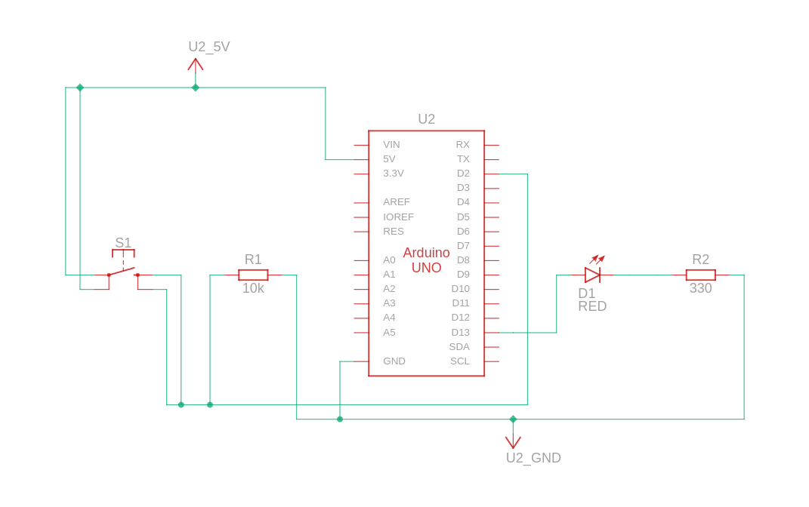
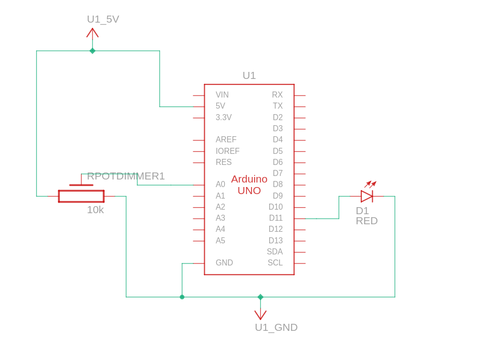

# Sistemas Embarcados - Contato Inicial

Utilize o kit com Arduino entregue a você para implementar dois programas com as seguintes especificações. A documentação e o código fonte de cada solução devem estar em diretórios separados.

## Programa 1 - Interruptor LED

1. Monte um circuito com um Arduino, um LED e um botão.

2. Implemente o software de uma aplicação que utilize o botão para acender e apagar o LED. O botão funciona como interruptor, ou seja, cada vez que o botão for pressionado, o estado do LED se alterna entre ligado e desligado.

3. Foi utilizado o conceito de máquina de estados para implementação da solução do problema proposto

4. Segue imagem do esquemárico elétrico:

5. Segue imagem com o componentes eletrônicos utilizados:

## Programa 2 - Voltímetro e Dimmer Digital

1. Monte um circuito com um Arduino, um LED e um potenciômetro de 10kohm.

2. Implemente o software de uma aplicação que, a cada segundo, leia o valor do conversor analógico-digital conectado à saída do potenciômetro, imprima o resultado da leitura em volts, use o valor lido para ajustar o brilho do LED, proporcionalmente.

3. Para implementação da solucão proposta pelo problema, foi utilizado a função *map()* que permite mapear um valor de uma faixa para outra faixa, nesse caso de valor analógico de entrada medida do potênciometro, que é de 10 bits, para o valor digital de 8 bits, e inserido esse valor na saida digital pro Led, assim, oscilando sua luminosidade, conforme o calor vai oscilando pelo potênciometro.4. 

4. Segue imagem do esquemárico elétrico:

5. Segue imagem com o componentes eletrônicos utilizados:

