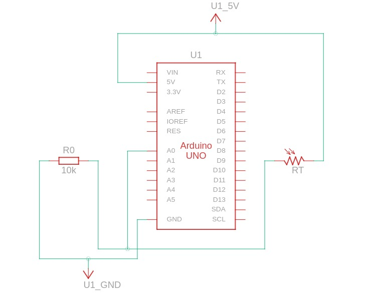
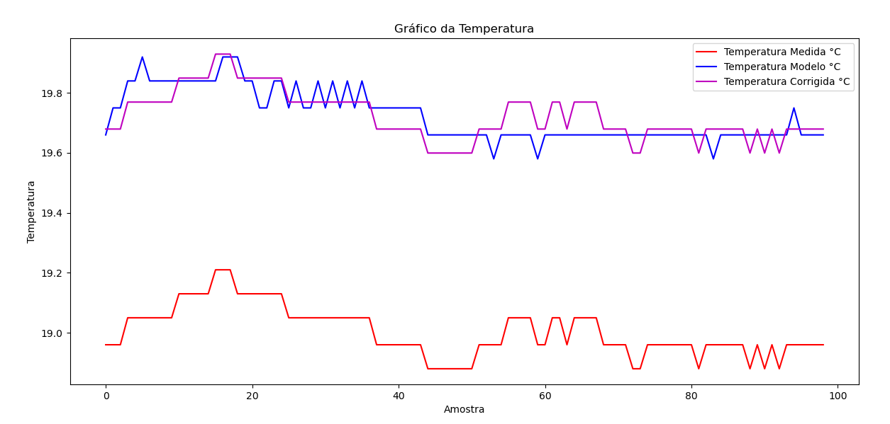

# IFSC - Sistemas Embarcados - Sensores

Nesta atividade você modelará, calibrará e implementará o software para ler temperatura a partir do termistor NTC. Ao final você deve entregar um relatório curto apresentando:
* O esquema elétrico do projeto (Arduino + NTC);

* O modelo (diagrama de blocos de atores e equações);
* Os parâmetros do modelo (obtenção dos coeficientes de [Steinhart-Hart](https://en.wikipedia.org/wiki/Steinhart%E2%80%93Hart_equation) para o seu sensor);
    * A = -1.1011e-03
    * B = 5.9740e-04
    * C = -1.3336e-06
* Obtenção dos erros aleatório e sistemático;

* Uma curva de erro do sensor (resultado do seu modelo - resultado do sensor de referência).
Observação: O modelo do circuito elétrico foi realizado pelo professor durante as aulas, assim como a medição de alguns pontos da curva Resistência X Temperatura para cálculo dos parâmetros do modelo Steinhart-Hart.
