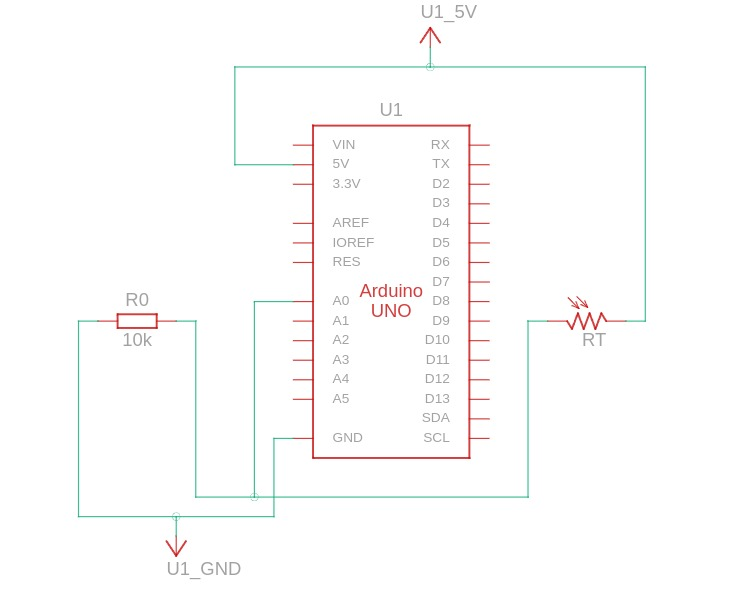
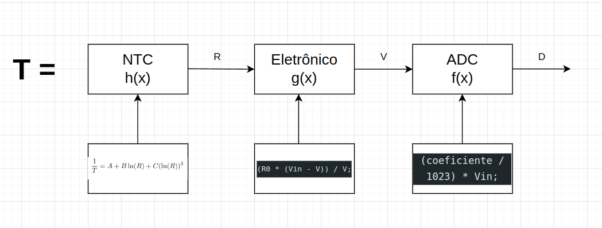
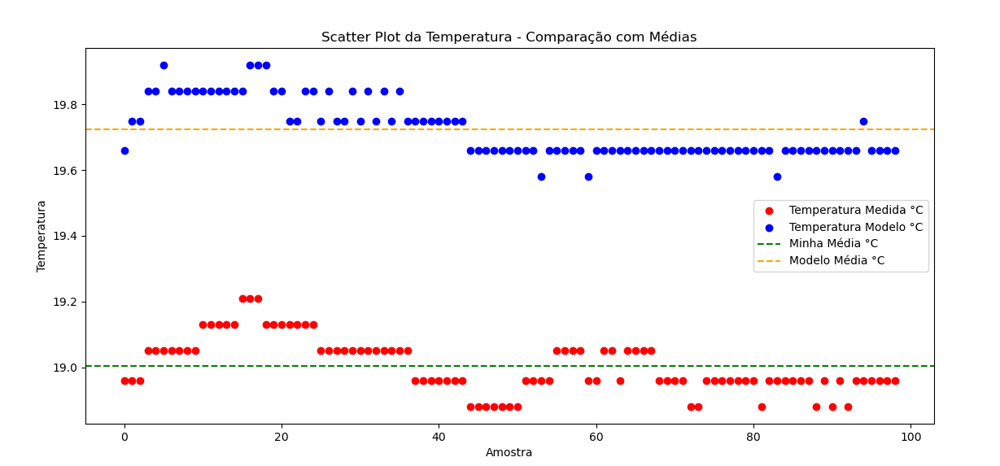
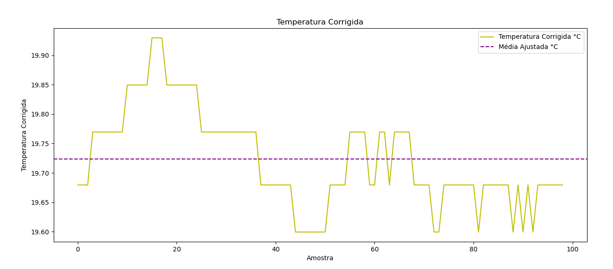

# IFSC - Sistemas Embarcados - Sensores

Nesta atividade você modelará, calibrará e implementará o software para ler temperatura a partir do termistor NTC. Ao final você deve entregar um relatório curto apresentando:
* O esquema elétrico do projeto (Arduino + NTC);

    O objetivo deste laboratório, é calcular o valor de temperatura atual, partir de valores coletados por um termistor NTC. São feitos alguns processos pelo algorítimo criado, até chegar no valor em graus celsius, foi utilizado o  modelo Steinhart-Hart.
Abaixo segue o esquema elétrico do projeto:

* O modelo (diagrama de blocos de atores e equações);

* Os parâmetros do modelo (obtenção dos coeficientes de [Steinhart-Hart](https://en.wikipedia.org/wiki/Steinhart%E2%80%93Hart_equation) para o seu sensor);

    Para acharmos os coeficientes A, B e C, primeiramente foram realizados tres medições em sala de aula, temperatura ambiente, temperatura fria, e temperatura quente, com suas devidas resistências anotadas. Posteriormente foi calculado com o [algorítimo em matlab.](Codigos/coeficiente.m)
    * A = -1.1011e-03
    * B = 5.9740e-04
    * C = -1.3336e-06

* Obtenção dos erros aleatório e sistemático;

* Uma curva de erro do sensor (resultado do seu modelo - resultado do sensor de referência).

    O método envolve comparar uma série de medições com uma série de modelos que representam valores corretos. Calcula-se a média das amostras em ambas as séries e, ao subtrair a média das medições pela média dos modelos, obtém-se um fator de correção. Esse fator é adicionado a cada valor na série de medições, corrigindo de forma sistemática os desvios encontrados. No entanto, é fundamental garantir que o erro sistemático seja constante e que a série de modelos seja precisa, validando a correção para garantir resultados mais precisos e confiáveis.

